# CATDOG2025宠物翻译器 系统流程图

## 文档信息

| 项目 | 内容 |
|------|------|
| 软件名称 | CATDOG2025宠物翻译器 |
| 软件版本 | V1.0.0 |
| 文档类型 | 系统流程图 |
| 文档版本 | V1.0 |
| 编写日期 | 2025年1月 |

---

## 1. 软件总体流程图

### 1.1 应用启动与初始化流程

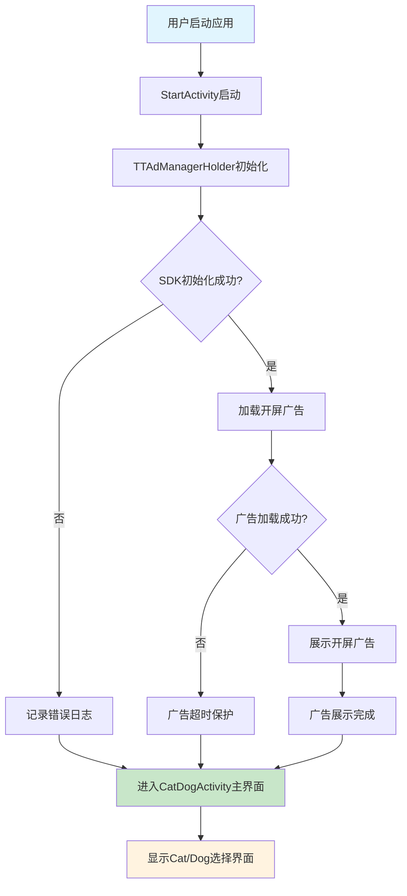

### 1.2 主界面操作流程

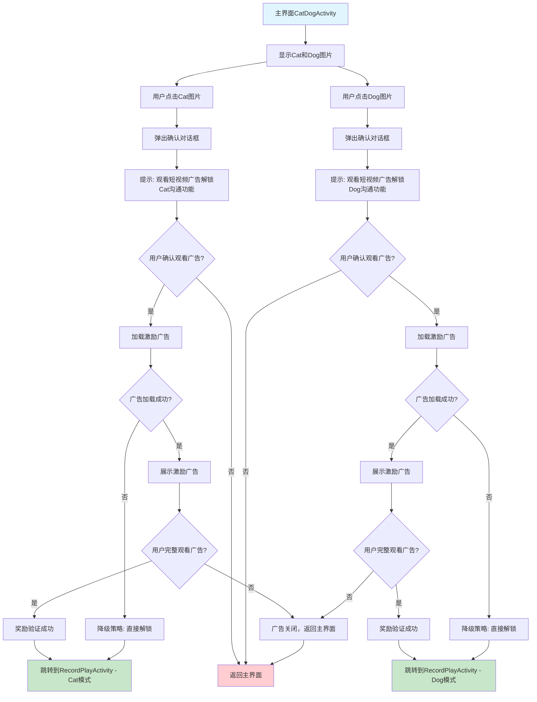

---

## 2. 核心功能流程图

### 2.1 录音播放功能流程

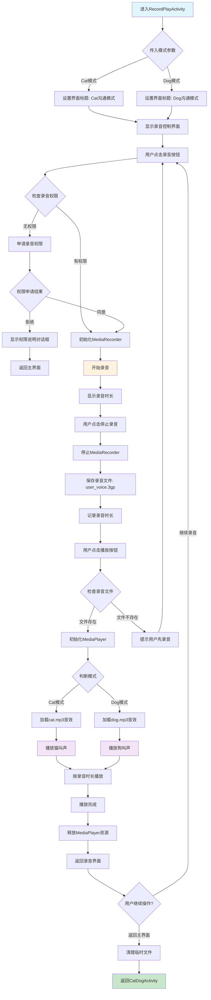

### 2.2 广告管理流程

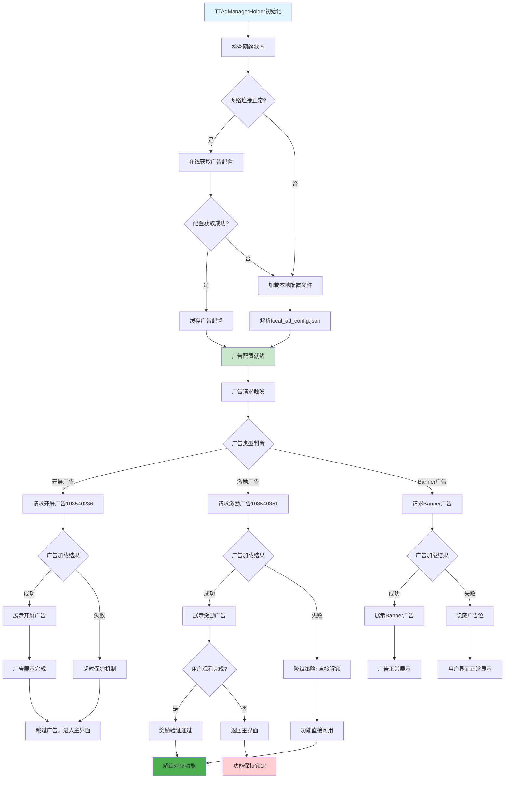

---

## 3. 用户交互流程图

### 3.1 完整用户体验流程

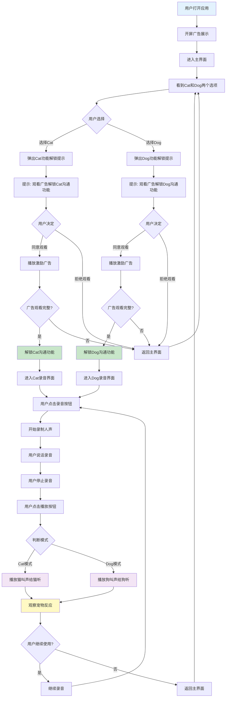

### 3.2 错误处理流程

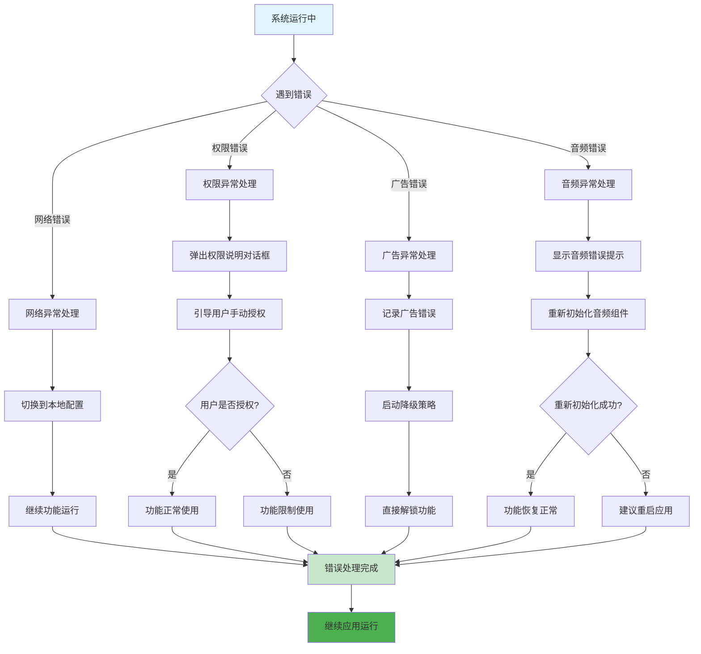

---

## 4. 数据流向图

### 4.1 音频数据流向

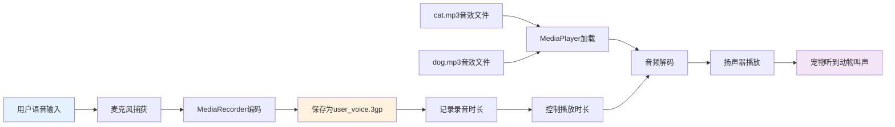

### 4.2 广告数据流向

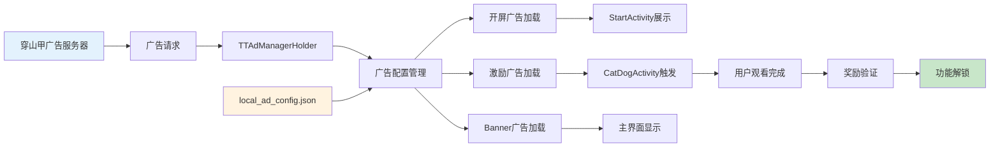

---

## 5. 系统状态转换图

### 5.1 应用状态转换

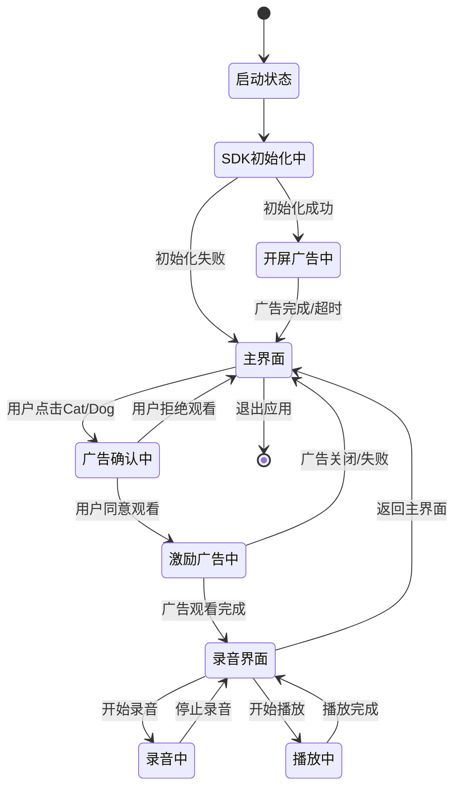

### 5.2 广告状态转换

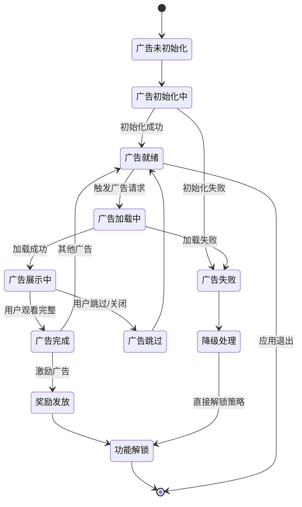

---

## 6. 技术架构流程图

### 6.1 MVC架构流程

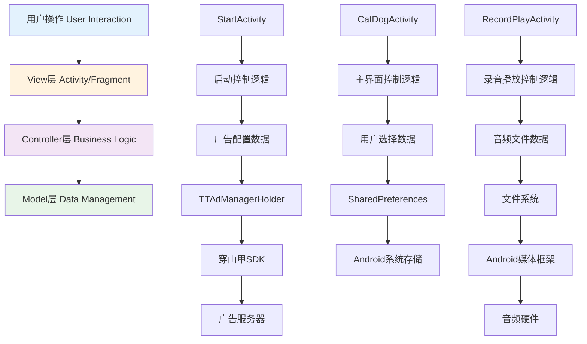

---

*本文档提供了CATDOG2025宠物翻译器的完整系统流程图，涵盖用户操作、系统处理、数据流向等各个方面，为软件著作权登记提供流程图支撑文档。* 